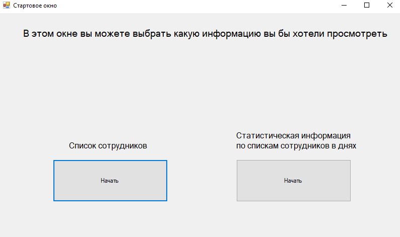
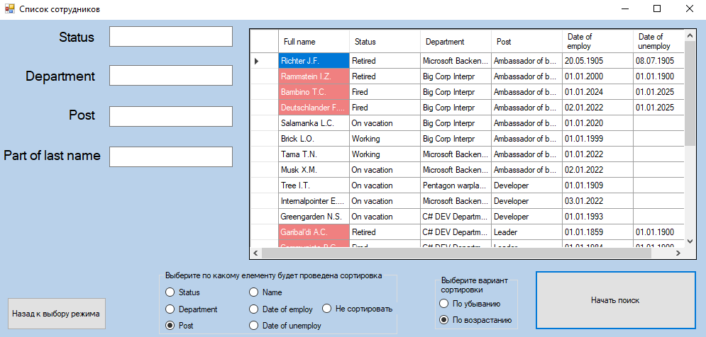
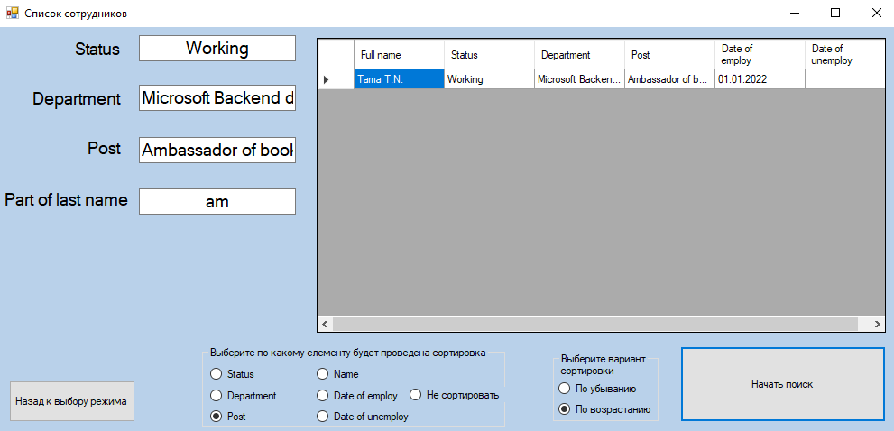
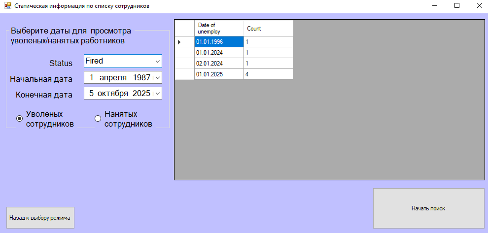

# 🏢 WinForms Employees Information App

**Профессиональное приложение для управления данными сотрудников**

---
## 📋 О проекте

Проект разработан в точном соответствии с техническим заданием с соблюдением всех требований и рекомендаций. Приложение предоставляет удобный интерфейс для работы с базой данных сотрудников компании.

---

## ✨ Основные возможности

### 👥 Управление списком сотрудников
- **Полная информация**: ФИО (в формате Фамилия И.О.), статус, отдел, должность, даты приема/увольнения
- **Гибкая сортировка**: Возможность сортировки по любому полю
- **Мощная фильтрация**: Фильтрация по статусу, отделу, должности и части фамилии

### 📊 Статистика и аналитика
- **Динамическая статистика**: Количество сотрудников по статусам
- **Временные периоды**: Статистика принятых/уволенных сотрудников за выбранный период
- **Детализация**: Разбивка данных по дням с переключением между типами статистики

### 🎯 Визуальные особенности
- **Цветовая легенда**: Подсветка ФИО уволенных сотрудников
- **Интуитивный интерфейс**: Удобное управление данными
- **Валидация данных**: Проверка корректности вводимых данных
---
## 🛠 Технологический стек

| Компонент | Технология |
|-----------|------------|
| **Frontend** | C# WinForms |
| **Backend** | .NET Framework |
| **Database** | MS SQL Server |
| **Data Access** | Хранимые процедуры |
| **Version Control** | Git |
---

## 🖼️ Скриншоты приложения

### 🏠 Стартовое окно

 
<strong>🎯 Главная страница системы</strong>

#

### 👥 Список сотрудников

 
<small>📄 Результат без параметров</small>

 
<small>📄 Сортировка по позиции в компании</small>

 
<small>📄 Результат запроса с параметрами</small>

#

### 📊 Статистика найма и увольнений

 
<small>📋 Количество и даты увольнения сотрудников с 1987 по 2025</small>

 
<small>📋 Количество и даты найма сотрудников находящихся в отпуске</small>

---

## 📞 Контакты

### 💼 Свяжитесь со мной

**📧 Email:** kabalya05@gmail.com 
**📱 Telegram:** [@Anton_Zhabotinskyi](https://t.me/Anton_Zhabotinskyi)

---
